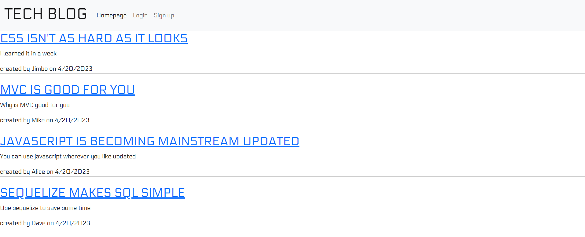

# TechBlog

## Description
Allows unregestered users to view blog posts on tech issues.  Allows registered users to create, update, and delete blogposts.  Registered users can also leave comments on blog posts.

## Table of Contents
- [TechBlog](#techblog)
  - [Description](#description)
  - [Table of Contents](#table-of-contents)
  - [Installation](#installation)
  - [Usage](#usage)
  - [Licence](#licence)
  - [Contributing](#contributing)
  - [Tests](#tests)
  - [Questions](#questions)
  - [Screenshot](#screenshot)
  - [Link to Github repository](#link-to-github-repository)
  - [Link to Deployed Website](#link-to-deployed-website)

## Installation
Navigate to the webpage.
## Usage
Navigate to the webpage. On the homepage you can view all created blogposts. If you click on the blog post title you will be taken to a page with the blogpost and comments.  Users can register and sign in to be able to add comments.  If you are registered you can also create new blog posts. Registered users have a link to their dashboard to create a new post.  Once created these posts can be edited or deleted.
## Licence
This project uses the [MIT](https://opensource.org/license/mit/) license.

## Contributing
If you would like to contribute to this project email me at the address below.
## Tests
None at this time.
## Questions
If you have any questions you can contact me at [michaeloc@verizon.net](michaeloc@verizon.net)  
Visit me at [Github](https://github.com/michaeloc1)
## Screenshot

## Link to Github repository
[Link](https://github.com/michaeloc1/TechBlog) to Github repository.
## Link to Deployed Website
[Link](https://nameless-dusk-20792.herokuapp.com/) to deployed website.
